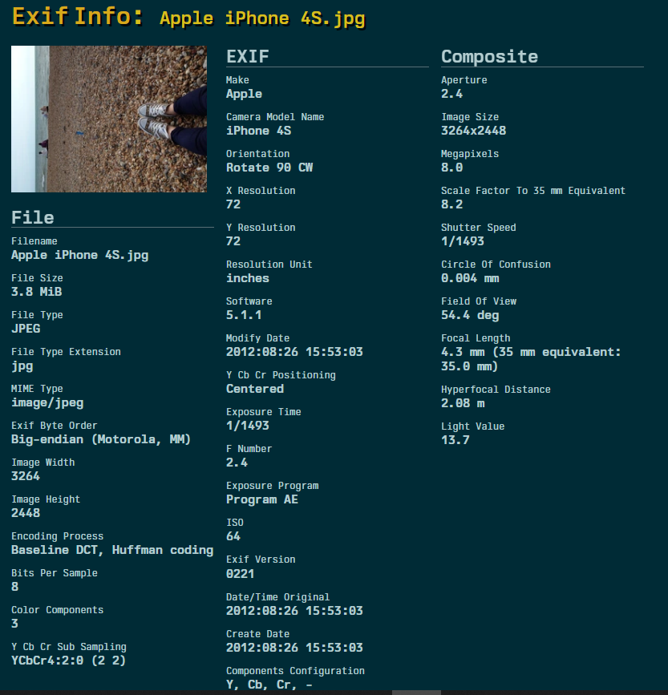
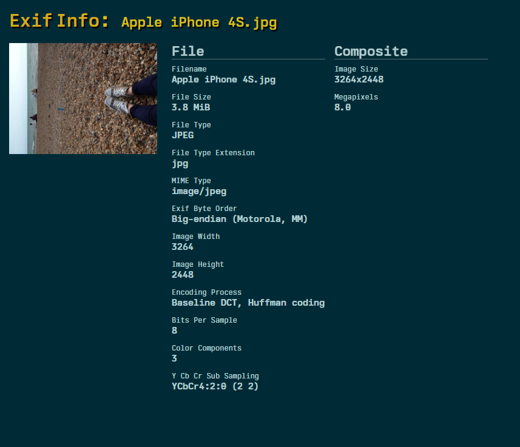
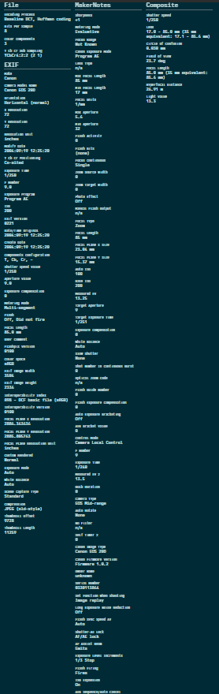
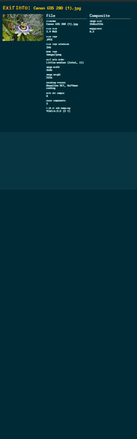
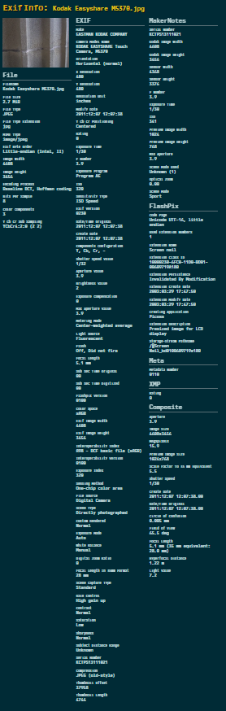
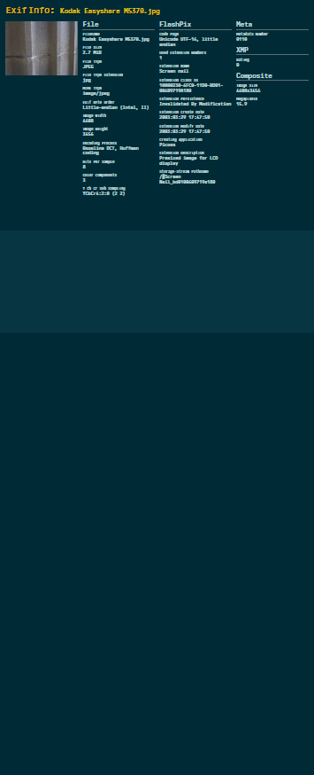

# EXIF Extractor & Cleaner
The EXIF Extractor is a Rust-based tool designed to efficiently parse, extract, and clean EXIF metadata from JPG images. EXIF (Exchangeable Image File Format) metadata provides essential information about the image, such as camera settings, date and time, and geolocation data.

## How to run
Download project:
```
git clone https://github.com/dawidzawislak/exif-extractor
```
Run the project with the following commands:
```
cd exif-extractor
cargo run <path/to/photo.jpg> <flags>
```
Options:
- `-p` or `--print` - prints all EXIF tags
- `-o` or `--output` `<outputname.txt>` - saves all EXIF tags to a file named `<outputname.txt>`
- `-c` or `--clean` - removes all EXIF tags and:
    - `-n` / `-new` `<filename.jpg>`- creates a new file named `filename.jpg` with the cleaned EXIF data
    - none - overwrites the original file with the cleaned EXIF data

Additional flags:
- `-h` or `--help` - prints help message
- `-v` or `--version` - prints version

## Example
All photos used in the examples are located in the `resources/images` directory and corresponding output files are located in the `resources/cleaned` directory. Also, the `*.txt` data extracted from the photos is saved in the `resources/output` directory.
<table>
    <thead>
        <tr>
            <th>Before</th>
            <th>After</th>
        </tr>
    </thead>
    <tbody>
        <tr>
            <td align="center"></td>
            <td align="center"></td>
        </tr>
        <tr>
            <td align="center"></td>
            <td align="center"></td>
        </tr>
        <tr>
            <td align="center"></td>
            <td align="center"></td>
        </tr>
    </tbody>
</table>

Short slice of the output file:
```
------------ IDF TAGS ------------
Image width: 4608
Image height: 2592
Manufacturer of the recording equipment: samsung
Recording equipment model: SM-G970F
Orientation of image: 1
Image resolution in width direction: 72/1
Image resolution in height direction: 72/1
Image resolution unit (inches): 2
Software used to create image: G970FXXSGHWC2
Photo created at: 2024:05:24 12:14:02
Y and C positioning: 1
------------ GPS TAGS ------------
N or S latitude: N
Latitude: 49 degs 22 minutes 53.96664 seconds
W or E longitude: E
Longitude: 20 degs 57 minutes 5.337359 seconds
------------ EXIF TAGS ------------
Exposure time [s]: 0.02
F-number: 2.2
Exposure Time: 2
ISO Speed Ratings: [200, 0]
Exif version: 0220
Datetime original: 2024:05:24 12:14:02
Datetime original digitized: 2024:05:24 12:14:02
Offset time: +02:00
...
```
## Tests
Unit tests are located in same file as the source code. To run tests, use the following command:
```
cargo test
```

## Supported file formats
Currently only JPG files are supported.

## Test & Example photos
Photos used in tests and examples are acquired from [github](https://github.com/drewnoakes/metadata-extractor-images)